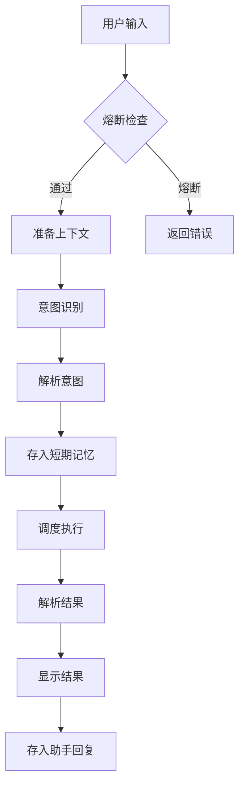

# 📚 第3课：CLI 入口分析（cli.py）

> **学习日期**：2026-05-25
> **学习目标**：深入理解 Aligo 项目的入口文件 cli.py，追踪从用户输入到 Agent 响应的完整请求链路

---

## 一、文件概览 🌍

`cli.py` 是整个 Aligo 商旅助手的**入口文件**，约 **828 行**，使用 Rich 库构建美观的终端界面。

```
cli.py ─── Aligo 商旅助手 CLI 入口
├── AligoCLI 类（主类）
│   ├── 初始化：__init__ / initialize_system
│   ├── 交互：run（事件循环）/ print_help / print_banner
│   ├── 核心处理：process_query（灵魂！）
│   ├── 结果展示：_display_agents_called / _display_results / _generate_human_response
│   ├── 状态查询：show_status / show_history / show_preferences / run_health_check
│   └── 工具：_get_long_term_summary / _get_agent_display_name
│
├── run_health_check_standalone() - 独立健康检查
└── main() - 程序入口
```

---

## 二、程序入口：main() → run()

### 2.1 main() 函数

```python
def main():
    """主函数——程序入口"""
    # 支持命令行参数：python cli.py health（不进入交互模式）
    if len(sys.argv) > 1 and sys.argv[1].strip().lower() == "health":
        exit(run_health_check_standalone())
    
    # 正常启动：创建 CLI 实例并运行
    cli = AligoCLI()
    asyncio.run(cli.run())  # ⭐ 启动异步事件循环
```

**对比 Java：** 相当于 `public static void main(String[] args)`

| 特性 | Java | Python |
|:----|:----|:-------|
| 入口方法 | `public static void main(String[] args)` | `def main():` + `if __name__ == "__main__"` |
| 命令行参数 | `args` 数组 | `sys.argv` 列表 |
| 调用方式 | JVM 自动调用 | 脚本末尾显式调用 `main()` |

### 2.2 run() 事件循环

```python
async def run(self):
    """运行 CLI——事件循环（对比 Java 的 while(true) 主循环）"""
    self.print_banner()        # 打印欢迎界面
    await self.initialize_system()  # 初始化所有组件
    
    while True:
        user_input = Prompt.ask("\n[cyan]>[/cyan]")
        command = user_input.strip().lower()
        
        # 命令路由（对比 Java 的 switch-case）
        if command == "exit":
            break
        elif command == "help":
            self.print_help()
        elif command == "status":
            self.show_status()
        elif command == "health":
            await self.run_health_check()
        elif command == "clear":
            self.memory_manager.short_term.clear()
        elif command == "history":
            self.show_history()
        elif command == "preferences":
            self.show_preferences()
        else:
            # 自然语言 → 核心处理流程
            await self.process_query(user_input)
```

**执行流程：**
```
用户启动程序
    ↓
main()
    ↓
AligoCLI() ─── 创建实例（__init__）
    ↓
cli.run()
    ├── print_banner()      ← Rich 风格的欢迎横幅
    ├── initialize_system() ← 初始化所有组件 ⭐
    └── while True:         ← 事件循环
        ├── help → print_help()
        ├── status → show_status()
        ├── health → run_health_check()
        ├── history → show_history()
        ├── preferences → show_preferences()
        ├── clear → 清空短期记忆
        ├── exit → break
        └── 自然语言 → process_query() ⭐ 核心！
```

---

## 三、系统初始化：initialize_system() ⭐

这是所有组件组装的地方，相当于 Java 的 **依赖注入（DI）+ @PostConstruct**。

```python
async def initialize_system(self):
    """初始化系统——像 Java 的 Spring 容器启动"""
    
    # 1️⃣ 获取用户信息
    self.user_id = Prompt.ask("用户ID", default="default_user")
    self.session_id = str(uuid.uuid4())[:8]  # 生成会话ID
    
    # 2️⃣ 初始化框架
    init_agentscope()
    
    # 3️⃣ 创建 LLM 模型（封装了豆包 API 调用）
    self.model = OpenAIChatModel(
        model_name=LLM_CONFIG["model_name"],
        api_key=LLM_CONFIG["api_key"],
        client_kwargs={"base_url": LLM_CONFIG["base_url"]},
        temperature=LLM_CONFIG.get("temperature", 0.7),
        max_tokens=LLM_CONFIG.get("max_tokens", 2000),
    )
    
    # 4️⃣ 创建记忆管理器
    self.memory_manager = MemoryManager(
        user_id=self.user_id,
        session_id=self.session_id,
        llm_model=self.model
    )
    
    # 5️⃣ 创建意图识别智能体（预加载 → 每次都用到）
    self.intention_agent = IntentionAgent(name="IntentionAgent", model=self.model)
    
    # 6️⃣ 创建懒加载注册器（其他 Agent 用到才加载）
    lazy_registry = LazyAgentRegistry(
        model=self.model,
        cache=self._agent_cache,
        memory_manager=self.memory_manager
    )
    
    # 7️⃣ 创建协调器
    self.orchestrator = OrchestrationAgent(
        name="OrchestrationAgent",
        agent_registry=lazy_registry,
        memory_manager=self.memory_manager
    )
    
    # 8️⃣ 创建熔断器（稳定性保障）
    self.circuit_breaker = CircuitBreaker(
        failure_threshold=5,
        recovery_timeout_sec=60.0,
        half_open_successes=2,
    )
```

### 初始化链路图

```
initialize_system()
    │
    ├─ ① Prompt.ask("用户ID")        ── 终端交互获取用户
    ├─ ② init_agentscope()           ── AgentScope 框架初始化
    ├─ ③ OpenAIChatModel(...)        ── LLM 模型（豆包 API 客户端）
    ├─ ④ MemoryManager(...)          ── 记忆管理器（短期 + 长期）
    ├─ ⑤ IntentionAgent(...)         ── 意图识别（预加载！）
    ├─ ⑥ LazyAgentRegistry(...)      ── 插件注册器（懒加载）
    └─ ⑦ OrchestrationAgent(...)     ── 协调器
```

### 🤔 为什么 IntentionAgent 预加载，其他 Agent 懒加载？

| Agent | 加载方式 | 原因 |
|:-----|:--------|:----|
| **IntentionAgent** | ⚡ 预加载 | 每个请求都需要它（大脑！） |
| 其他子 Agent | 🦥 懒加载 | 不一定被调用，用到才加载 |
| OrchestrationAgent | ⚡ 预加载 | 调度核心，必须常驻 |

> **对比 Java：** 类似于 Spring 的 `@Lazy` 注解——懒加载 Bean 在首次注入时才创建，减少启动时间。

---

## 四、核心处理流程：process_query() 💥

这是整项目的**灵魂流程**，每个自然语言输入都会经过这里。

```python
async def process_query(self, user_input: str):
    """
    处理用户查询——整套流水线的核心
    
    对比 Java：Controller 层的方法
    """
    import time
    start_time = time.time()
    
    # ---------- ① 熔断检查 ----------
    if self.circuit_breaker:
        self.circuit_breaker.raise_if_open()  # 如果熔断，抛异常
    
    # ---------- ② 准备上下文 ----------
    # 获取长期记忆（用户偏好、历史行程）
    long_term_summary = await self._get_long_term_summary(user_input)
    # 获取短期记忆（最近5轮对话）
    recent_context = self.memory_manager.short_term.get_recent_context(n_turns=5)
    
    # 组装成 Msg 列表（AgentScope 的消息格式）
    context_messages = []
    if long_term_summary:
        context_messages.append(Msg(name="system", content=long_term_summary, role="system"))
    for msg in recent_context:
        context_messages.append(Msg(name=msg["role"], content=msg["content"], role=msg["role"]))
    context_messages.append(Msg(name="user", content=user_input, role="user"))
    
    # ---------- ③ 意图识别（带重试！）----------
    intention_result = await retry_with_backoff(
        lambda: self.intention_agent.reply(context_messages),
        max_retries=3, base_delay_sec=1.0, max_delay_sec=30.0,
    )
    
    # ---------- ④ 解析意图结果 ----------
    intention_data = json.loads(intention_result.content)
    
    # ---------- ⑤ 保存用户输入到短期记忆 ----------
    self.memory_manager.add_message("user", user_input)
    
    # ---------- ⑥ 调度执行（带重试！）----------
    orchestration_result = await retry_with_backoff(
        lambda: self.orchestrator.reply(intention_result),
        max_retries=3, base_delay_sec=1.0, max_delay_sec=30.0,
    )
    
    # ---------- ⑦ 解析执行结果 ----------
    result_data = json.loads(orchestration_result.content)
    
    # ---------- ⑧ 显示结果 ----------
    self._display_agents_called(result_data)  # 显示调用了哪些Agent
    self._display_results(result_data)        # 显示最终结果
    
    # ---------- ⑨ 存入记忆 ----------
    self.memory_manager.add_message("assistant", json.dumps(result_data, ensure_ascii=False))
```

### 完整请求链路图

```
用户输入 → "我要从北京去上海出差"
    │
    ├─ ① 熔断检查
    │   └─ circuit_breaker.raise_if_open() → 没问题，继续
    │
    ├─ ② 准备上下文
    │   ├─ _get_long_term_summary() → "用户偏好：汉庭酒店..."
    │   └─ short_term.get_recent_context() → 最近5轮对话
    │
    ├─ ③ 意图识别（IntentionAgent）
    │   ├─ 传入：上下文消息列表
    │   ├─ 处理：LLM 理解语义 → 识别意图
    │   └─ 输出：JSON { "intentions": [...], "schedule": {...} }
    │
    ├─ ④ 解析意图结果
    │   └─ json.loads() → 得到调度计划
    │
    ├─ ⑤ 保存用户输入到短期记忆
    │
    ├─ ⑥ 调度执行（OrchestrationAgent）
    │   ├─ 优先级1：event_collection + preference + memory_query → 并行！
    │   ├─ 优先级2：itinerary_planning → 依赖前序结果
    │   └─ 聚合结果
    │
    ├─ ⑦ 解析执行结果
    │
    ├─ ⑧ 显示结果
    │   ├─ _display_agents_called() → "🤖 调用智能体: 事项收集 ✓, 偏好管理 ✓, 行程规划 ✓"
    │   └─ _display_results() → 打印行程详情
    │
    └─ ⑨ 保存助手回复到短期记忆
```

---

## 五、结果展示层（_display 系列方法）

### 5.1 智能体调用显示

```python
def _display_agents_called(self, result_data: dict):
    """显示调用了哪些智能体"""
    results = result_data.get("results", [])
    agents_called = []
    
    for result in results:
        agent_name = result.get("agent_name", "")
        status = result.get("status", "")
        display_name = self._get_agent_display_name(agent_name)
        
        # 根据状态添加标记
        if status == "success":
            agents_called.append(f"{display_name} ✓")
        elif status == "error":
            agents_called.append(f"{display_name} ✗")
    
    if agents_called:
        self.console.print(f"🤖 调用智能体: {', '.join(agents_called)}")
```

### 5.2 结果展示

`_display_results()` 和 `_generate_human_response()` 负责格式化输出，为每个 Agent 类型定制展示：

| Agent 类型 | 展示内容 | 示例 |
|:----------|:--------|:----|
| `itinerary_planning` | 每日行程、时间线、注意事项 | ✈️ 第1天 08:00 - 北京出发... |
| `preference` | 已更新的偏好项 | ✓ 酒店偏好 设置为 汉庭 |
| `event_collection` | 收集到的行程信息 | ✓ 已收集：北京→上海，3月11日 |
| `information_query` | 查询结果摘要 + 来源 | 🌤️ 北京明天 25°C... |
| `rag_knowledge` | 知识问答结果 | 差旅标准为... |
| `memory_query` | 记忆查询结果 | 您上次去北京是... |

---

## 六、辅助方法

### 6.1 长期记忆摘要

```python
async def _get_long_term_summary(self, user_input: str = "") -> str:
    """
    生成长期记忆摘要——为 IntentionAgent 提供上下文
    
    返回格式：
    【用户背景信息】
    • hotel_brands: 汉庭, 如家
    • seat_preference: 靠窗
    
    【历史会话总结】
    用户经常出差去上海，偏好经济型酒店...
    
    【历史行程】
    1. 北京 → 上海 (2026-03-11) - 商务会议
    """
```

> 💡 智能筛选：如果用户输入提到了某个地点，优先显示相关历史行程

### 6.2 智能体显示名称映射

```python
def _get_agent_display_name(self, agent_name: str) -> str:
    """Agent 英文名 → 中文显示名"""
    agent_display_names = {
        "event_collection": "事项收集",
        "preference": "偏好管理",
        "itinerary_planning": "行程规划",
        "information_query": "信息查询",
        "rag_knowledge": "知识库查询",
        "memory_query": "记忆查询",
    }
```

---

## 七、配置体系（config.py）

```python
LLM_CONFIG = {
    "api_key": "API_KEY",                    # API 密钥
    "model_name": "Model_Name",              # 模型名
    "base_url": "https://...",               # API 地址
    "temperature": 0.7,                      # 温度参数
    "max_tokens": 8192,                      # 最大 Token
}

SYSTEM_CONFIG = {
    "enable_llm": True,                      # 是否启用 LLM
    "log_level": "INFO",
    "max_retries": 3,
    "timeout": 60,
}

RESILIENCE_CONFIG = {
    "max_retries": 3,                        # 重试次数
    "retry_base_delay_sec": 1.0,             # 退避基数
    "retry_max_delay_sec": 30.0,             # 退避上限
    "circuit_failure_threshold": 5,          # 熔断阈值
    "circuit_recovery_timeout_sec": 60.0,    # 恢复等待
    "circuit_half_open_successes": 2,        # 半开成功次数
    "health_check_timeout_sec": 10.0,        # 健康检查超时
}
```

---

## 八、类图一览 🏗️

```
AligoCLI
├── 属性
│   ├── console: Console                  ← Rich 终端
│   ├── user_id: str                      ← 当前用户
│   ├── session_id: str                   ← 会话 ID
│   ├── model: OpenAIChatModel            ← LLM 模型
│   ├── memory_manager: MemoryManager     ← 记忆管理器
│   ├── intention_agent: IntentionAgent   ← 意图识别
│   ├── orchestrator: OrchestrationAgent  ← 协调器
│   ├── _agent_cache: dict                ← Agent 缓存
│   └── circuit_breaker: CircuitBreaker   ← 熔断器
│
├── 方法（按调用顺序）
│   ├── print_banner()                    ← 欢迎界面
│   ├── print_help()                      ← 帮助列表
│   ├── initialize_system()               ← ⭐ 初始化
│   ├── process_query()                   ← ⭐⭐ 核心流水线
│   ├── _display_agents_called()          ← 显示调用列表
│   ├── _display_results()                ← 显示结果
│   ├── _generate_human_response()        ← 生成人性化回复
│   ├── _get_long_term_summary()          ← 获取记忆摘要
│   ├── _get_agent_display_name()         ← 名称映射
│   ├── show_status()                     ← 状态查询
│   ├── run_health_check()                ← 健康检查
│   ├── show_history()                    ← 历史行程
│   ├── show_preferences()                ← 偏好查看
│   └── run()                             ← ⭐ 事件循环
```

---

## 九、与 Java 的对比 🆚

| cli.py 概念 | Java 等价物 | 说明 |
|:-----------|:-----------|:----|
| `asyncio.run(cli.run())` | `SpringApplication.run()` | 启动入口 |
| `initialize_system()` | `@PostConstruct` + DI | 依赖组装 |
| `while True` 事件循环 | `while(true)` | 主循环 |
| `Prompt.ask()` | `Scanner.nextLine()` | 终端输入 |
| `process_query()` | `@PostMapping("/query")` | Controller 层 |
| `_display_results()` | 前端渲染 | 结果展示 |
| `intention_agent.reply()` | 调用 Service 层 | 业务逻辑 |
| `circuit_breaker.raise_if_open()` | Resilience4j `CircuitBreaker` | 熔断保护 |
| `retry_with_backoff()` | Spring Retry `@Retryable` | 重试机制 |
| `self._agent_cache` | `Map<String, Object>` 缓存 | 懒加载缓存 |

---

## 十、动手练习 🧪

### 练习1：画出流程图



### 练习2：理解请求链路

打开 `cli.py`，追踪一次 `"我想去北京出差"` 的完整调用链：

1. 在 `process_query()` 中逐行阅读
2. 标注每一行代码对应上图中的哪一步
3. 思考：如果 LLM 调用超时了，会触发什么机制？

### 练习3：配置文件理解

打开 `config.py`，回答以下问题：
- `RESILIENCE_CONFIG` 中的 `circuit_failure_threshold: 5` 是什么意思？
- `max_retries: 3` 和 `retry_base_delay_sec: 1.0` 组合的效果是什么？
- 如果 API 密钥没设置，程序会在哪一步报错？

---

## 十一、总结 📖

### 本节要点

| 知识点 | 掌握程度 |
|:------|:--------:|
| cli.py 的整体结构和类方法组织 | ⭐⭐⭐ |
| `initialize_system()` 的初始化链路 | ⭐⭐⭐⭐ |
| `process_query()` 的 9 步核心流水线 | ⭐⭐⭐⭐⭐ |
| 熔断检查→意图识别→调度执行→结果展示的顺序 | ⭐⭐⭐⭐ |
| 结果展示的 Agent 类型分发逻辑 | ⭐⭐⭐ |
| `_get_long_term_summary()` 的记忆摘要生成 | ⭐⭐⭐ |
| 配置体系（LLM / System / Resilience） | ⭐⭐⭐ |

---

> **📌 下节课预告**：第4课「意图识别智能体深度解析 —— IntentionAgent」—— 深入大脑级别的意图识别模块，看 LLM 如何理解自然语言并输出结构化调度计划。
